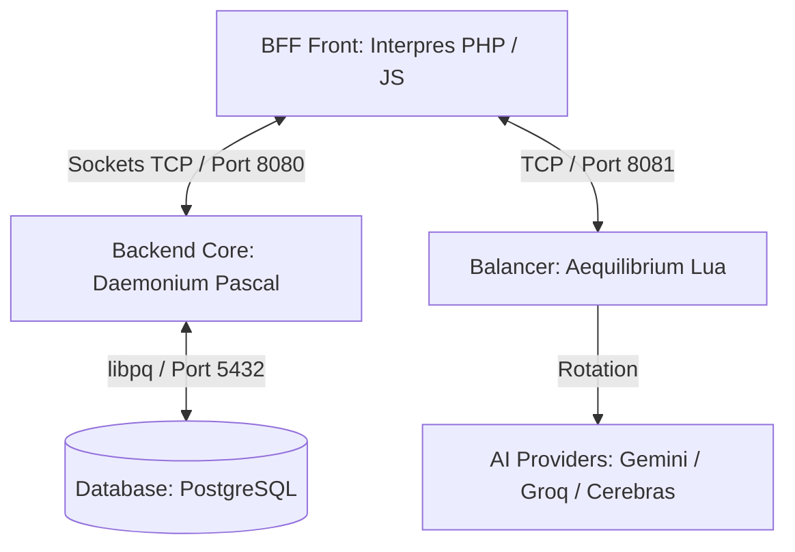

<div align="center">
  
</div>

<h1 align="center" style="color: #00FF00; text-shadow: 0 0 10px #00FF00;">
  
</h1>

<p align="center">
  <em style="font-family: 'Caveat', 'Brush Script MT', 'Comic Sans MS', cursive; font-size: 1.4em; color: #aaaaaa;">
  "Hoc est repositorium in quo vivit chat antiquus et arcanus, nunc potentia SQL confirmatus..."<br>
  (This is the repository where an arcane chat dwells, now fortified by the power of SQL...)
  </em>
</p>

---

## 📜 Prologus (Introduction)

**Necromancer** is an arcane chat interface and local backend system wrapped in the aesthetics of a retro CRT terminal and the lore of dark magic. It acts as a gateway to interact with an AI **Oraculum** (Oracle), using Latin incantations, occult themes, and ancient Roman personas.

While the project preserves its **retro CRT shell** and immersive mechanical soundscape, we have evolved its underlying architecture. The backend has migrated from fragile flat-text scroll files to a robust **PostgreSQL** database, coupled with the state-of-the-art **Argon2id hashing** (with seamless legacy **SHA-1 migration**) for user credentials. This ensures transactional integrity and security without losing a single drop of its gothic visual and auditory atmosphere.

Detailed internal structures and setup guidelines can be found in our **[Occult Library / Docs](docs/)**.

---

## 🏛️ Architectura Systematis (System Architecture)

The system is divided into four sacred pillars:



### 1. 🦇 Daemonium (The Core Backend)
* **Language**: FreePascal (`daemonium/`)
* **Role**: The heart and soul of the system. Operating on port `8080`, it manages socket connections, authorization, and message histories.
* **Modularized Architecture**: The daemon is split into 7 specialized units:
  * `Auxilia`: Common helpers and response wrappers.
  * `Cryptographia`: Pure Pascal **Argon2id** password hashing using `HashLib4Pascal`.
  * `Database`: Thread-safe PostgreSQL connection and schema initialization.
  * `ClavesLlm`: Dynamic API key status, rate-limit quarantine, and synchronization.
  * `Usores`: User registration, profile management, and automatic legacy SHA-1 migration.
  * `Fabulatio`: Interactive chat room lists and message history.
  * `Scientia`: Local keyword-indexed RAG search.
  * `daemonium.pas`: Core high-performance TCP socket dispatcher.
* **LLM Key Registry**: Protected by a fast Argon2id variant, it stores provider key health and failure events in PostgreSQL to filter disabled or resting keys automatically.

### 2. 👁️ Interpres (The Web Frontend & BFF)
* **Language**: PHP 8.3 + Vanilla JS
* **Role**: The visual gateway. It renders a classical CRT console interface with:
    * **SSE (Server-Sent Events)**: For real-time streamed responses from the Oracle.
    * **Advanced Audio Mixer**: A three-channel audio control center (Summa/Master, Sonus/SFX, Musica/Music) utilizing the **Web Audio API**. Boost volumes up to 200% with dynamic visual crimson overdrive glows above 100% and enjoy looped occult background scores.
    * **HTML5 Canvas**: Eldritch visual overlays (Matrix Rain, Blood Drips, Watching Eyes, and Ignis Fatuus reactive embers).
    * **Sanitization**: Deep input parsing to prevent pipe injection attacks over TCP sockets.
    * **Provider Failover**: Retries early provider failures by unpinning the current balancer session and requesting the next available provider/model candidate.

### 3. ⚖️ Aequilibrium (The Load Balancer)
* **Language**: Lua / LuaJIT (`aequilibrium/aequilibrium.lua`)
* **Role**: Runs on port `8081`. Provides provider rotation, key rotation, and session pinning for LLM connections when `AEQUILIBRIUM_ENABLED=true`.
* **Resiliency**: Built-in crash protection (`pcall`) and socket descriptor auto-closure to handle high concurrent traffic.

### 4. 🗃️ Tabularium (The Database)
* **System**: **PostgreSQL 15-alpine**
* **Role**: Replaces the ancient flat-text database. It stores structured tables:
  * `usores`: Nicknames, emails, secure Argon2id (and legacy SHA-1) password hashes, and user types.
  * `optiones`: Persisted user UI configurations stored as validated JSON objects.
  * `fabulatio`: Full conversational logs, automatically indexed for instantaneous search and fast retrieval.
  * **Relational Cascades**: Integrated `ON DELETE CASCADE ON UPDATE CASCADE` rules automatically clean user settings and chats when a soul is deleted.

---

## ✨ Mystica (Features)

### 🎭 Genera Accessus (Login Modes)
* **SPIRITUS**: Anonymous guest entry. Sign in with a nickname and explore the forum.
* **ANIMA**: Advanced email and password registration. Credentials are cryptographically protected using state-of-the-art **Argon2id** (with seamless backwards-compatible **SHA-1 migration** upon login).

### 🔮 Oraculum Agenticum (Agentic Features)
* **Instrumenta (Tools)**: The Oracle dynamically utilizes `search_web` (via DDG scraper) or `search_knowledge_base` (RAG from local occult texts).
* **Ratio Cogitandi (Reasoning)**: Streams the Oracle's thought process step-by-step prior to writing the final Latin response.
* **Nomina Automatica**: The Oracle automatically names new chat sessions with elegant Latin phrases based on the first message context.
* **Key Quarantine**: Repeated `429` responses place a key into a 30-minute rest period, while invalid or billing-blocked keys are disabled automatically.

### 🌌 Visus & Auditio (CRT Aesthetics)
* **Screen Shaking & CRT Glitches**: Fluid scanlines, chromatic aberration, and simulated mechanical hardware noise recreate a classic terminal feel.
* **Occult Skins**: Seven interactive full-screen HTML5 Canvas backgrounds including *Imber Codicis* (Matrix rain), *Sanguis Stillans* (dripping blood), *Nexus Fati* (web of fate), and *Ignis Fatuus* (Necromantic Embers - reactive floating particles that gather around your cursor).
* **Eldritch Acoustics**: Highly immersive, layered acoustics utilizing the Web Audio API:
  * **HDD Seek**: Realistic mechanical clicks and hard-drive seek noises synchronized with text generation.
  * **Haptic Keyboard**: Physical mechanical clicks for every key pressed.
  * **Laboratory Ambience**: Eerie, loopable white noise (wind, CRT hums, static electricity) to set a dark gothic atmosphere.

### 📈 Progressio & Moderatio (Initiation & Account Control)
* **User Levels**: Ascend through 13 secret levels of occult initiation based on the volume and depth of your interactions with the Oracle.
* **Profile Management**: Safely rename your soul (cascading across the database), change password keys, or completely erase your registration and histories (with complete atomic database cleanup).

---

## 🖼️ Media Expositio (Gallery)

<div align="center">
  <h3>Occult CRT Terminal V2</h3>
  
  <p><em>Behold the neon-green glowing phosphor interface with live AI Oracle reasoning.</em></p>
  
  <br>

  <h3>Eldritch Visual Overlays</h3>
  
  <p><em>Advanced HTML5 canvas rendering - Dripping Blood (Sanguis Stillans) and Necromantic Embers (Ignis Fatuus) in Cruor theme.</em></p>
</div>

---

## ⚙️ API Configuration (Quomodo API configurare)

The Oraculum supports two explicit LLM connection modes:

1. **Aequilibrium enabled**: requests use the Lua balancer and provider data from `tabularium/provisores/`.
2. **Aequilibrium disabled**: requests use a single custom OpenAI-compatible provider from `.env`.

Create `config.env` from `config.env.example` and choose the mode:

```ini
AEQUILIBRIUM_ENABLED=true
```

When `AEQUILIBRIUM_ENABLED=false`, configure your OpenAI-compatible provider inside `.env`:

```ini
# OpenAI or compatible LLM API endpoints
OPENAI_API_URL=https://your-provider.example/v1/chat/completions
OPENAI_API_MODEL=your-model-name-here
OPENAI_API_KEY=your_secret_api_key_here
```

To configure **Google Gemini** via its OpenAI-compatible endpoint:
```ini
OPENAI_API_URL=https://generativelanguage.googleapis.com/v1beta/openai/chat/completions
OPENAI_API_MODEL=gemini-2.5-flash-lite
OPENAI_API_KEY=your_gemini_api_key_here
```

When `AEQUILIBRIUM_ENABLED=true`, the `.env` OpenAI values are ignored and the active providers are loaded from `tabularium/provisores/`.
The currently maintained balancer providers in this repository are `gemini`, `groq`, and `cerebras`.

After modifying `.env` or `config.env`, rebuild your Docker containers:
```bash
docker-compose up --build -d
```

---

## 🔮 Magia Nigra (Docker Compose Setup)

The easiest way to summon the entire stack is through the containerization arts.

1. **Prepare the Incantation**:
   Copy `.env.example` to `.env`, copy `config.env.example` to `config.env`, then choose your LLM mode.
   ```bash
   cp .env.example .env
   cp config.env.example config.env
   ```

2. **Cast the Spell**:
   ```bash
   docker-compose up --build -d
   ```

3. **Enter the Gateway**:
   Point your browser to **[http://localhost:666](http://localhost:666)**.

---

## 🛠️ Quomodo incipere sine Magia (Manual Setup)

For developers wishing to run the components natively on Windows/Linux:

1. **Prerequisites**: Install FreePascal (`fpc`), `php`, and a local **PostgreSQL** server.
2. **Setup Schema**: Import the tables schema defined in **[Database Documentation](docs/database.md)**.
3. **Configure environment**:
   ```bash
   export DB_HOST="localhost"
   export DB_PORT="5432"
   export DB_NAME="necromancer"
   export DB_USER="postgres"
   export DB_PASS="your_password"
   ```
4. **Compile & Run Daemonium**:
   ```bash
   cd daemonium
   fpc daemonium.pas
   ./daemonium
   ```
5. **Run Interpres**:
   ```bash
   cd interpres
   php -S 127.0.0.1:666
   ```

---

<p align="center">
  <em style="font-family: 'Caveat', 'Comic Sans MS', cursive; font-size: 1.3em; color: #a30000; text-shadow: 0 0 5px #ff0000;">
  * Memento: Omnes viae Romam ducunt! *<br>
  (Remember: All roads lead to Rome!)
  </em>
</p>
