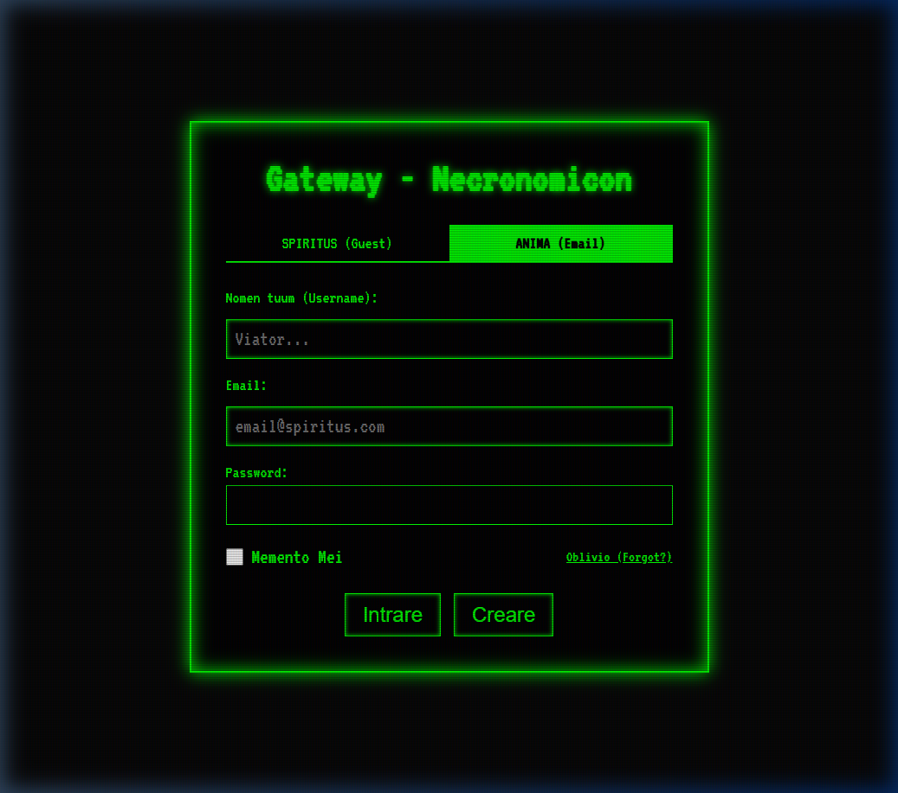
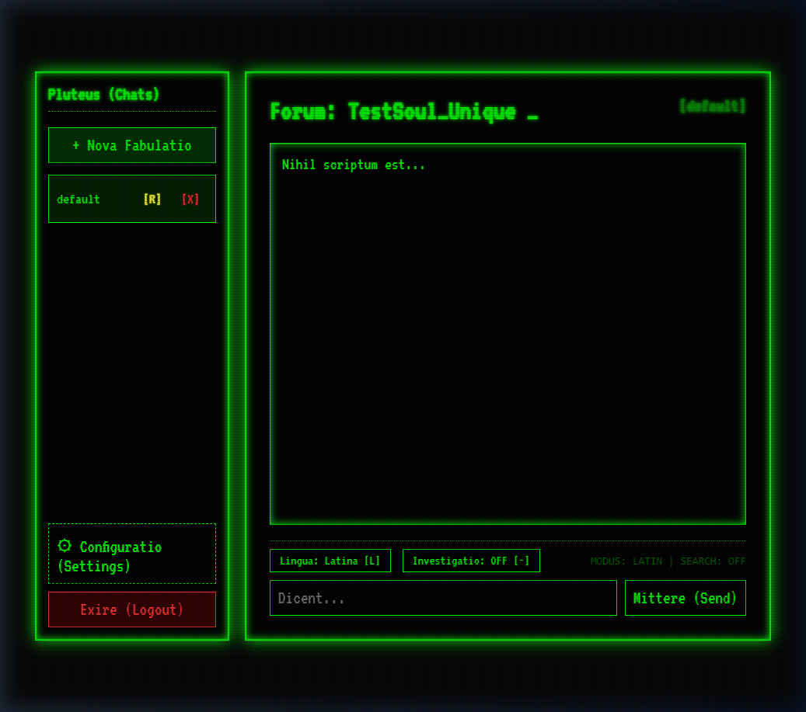
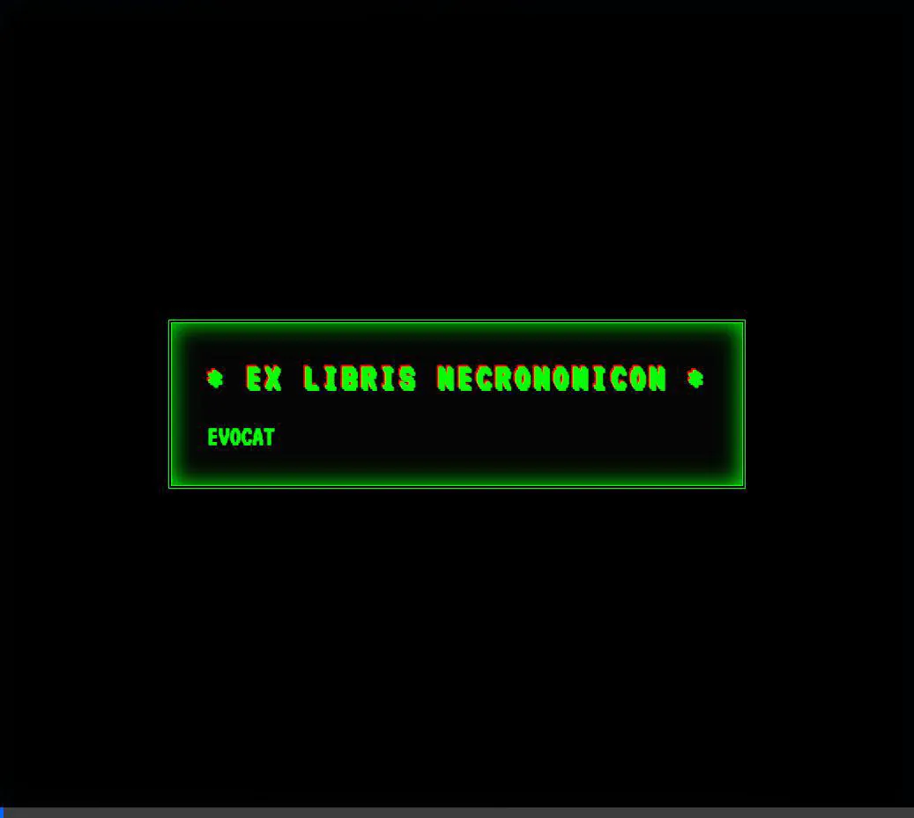

<div align="center">
  
</div>

<h1 align="center" style="color: #00FF00; text-shadow: 0 0 10px #00FF00;">
  
</h1>

<p align="center">
  <em style="font-family: 'Caveat', 'Brush Script MT', 'Comic Sans MS', cursive; font-size: 1.4em; color: #aaaaaa;">
  "Hoc est repositorium in quo vivit chat antiquus et arcanus..."<br>
  (This is the repository where an ancient and arcane chat dwells...)
  </em>
</p>

---

## 📜 Prologus (Introduction)

**Necromancer** is an arcane chat interface and local backend system wrapped in the aesthetics of a retro CRT terminal and the lore of dark magic. It is designed to act as a gateway to interact with an AI **Oraculum** (Oracle), using Latin incantations, occult themes, and ancient roman personas.

The system is highly modular, bridging ancient programming languages (Pascal) with modern web tech (PHP 8 + WebSockets/SSE) to communicate with modern LLM APIs (OpenAI, LocalAI, vLLM).

---

## 🏛️ Architectura Systematis (System Architecture)

The project is divided into three sacred pillars:

### 1. 🦇 Daemonium (The Core Backend)
* **Language**: FreePascal (`daemonium.pas`)
* **Role**: The heart and soul of the system. It operates on port `8080`, managing TCP sockets, users, chat histories, and the **RAG (Retrieval-Augmented Generation)** knowledge base. All internal logic, variables, and network protocols are meticulously written in Latin.

### 2. 👁️ Interpres (The Web Frontend & BFF)
* **Language**: PHP 8 + Vanilla JS
* **Role**: The visual gateway. It renders an HTML 3.2 / 4.01 classical "console" style interface.
* **Tech Stack**:
    * **SSE (Server-Sent Events)**: For real-time Oracle responses.
    * **Web Audio API**: Synthesizing retro hardware sounds (HDD, mechanical clicks, ambient hum).
    * **HTML5 Canvas**: Rendering advanced eldritch visual effects (Matrix, Stars, Blood).

### 3. 🗃️ Tabularium (The Database)
* **Format**: Flat File System (`.txt`)
* **Role**: All data is preserved in physical text files, eschewing modern databases for ancient scrolls.
  - `usores.txt`: Registry of souls (users, emails, passwords).
  - `scientia/`: The occult knowledge base for the RAG system.
  - `fabulatio_*.txt`: The transcribed histories of conversations between users and the Oracle.

---

## ✨ Mystica (Features)

### 🎭 Genera Accessus (Login Modes)
* **SPIRITUS**: Guest mode. Enter a nickname and wander the halls.
* **ANIMA**: Full email & password authentication, with "Remember Me" capabilities.

### 🔮 Oraculum Agenticum (Agentic Features)
* **Instrumenta (Tools)**: The Oracle can use `search_web` (via DuckDuckGo) or `search_knowledge_base` (RAG) to find answers.
* **Ratio Cogitandi (Reasoning)**: Visualizes the Oracle's internal thought process before providing the final response.
* **Nomina Automatica**: Every new conversation is automatically titled in Latin by the Oracle.

### 🌌 Visus & Auditio (Visuals & Audio)
* **Visual Glitches**: Unlockable CRT glitches, screen shakes, and eldritch overlays:
    * *Matrix Rain*, *Infernal Pulse*, *Visceral Blood Drips*, *Stellar Void*, *Watching Eyes*, and *Web of Fate*.
* **Eldritch Acoustics**:
    * **HDD Seek**: Sounds of an ancient drive reading the Lexicon.
    * **Mechanical Clicks**: Real haptic-style feedback for every keystroke.
    * **Ambient Winds & Hum**: Immersive atmosphere of a forbidden laboratory.

### 📈 Progressio & Moderatio
* **User Levels**: Ascend through 13 levels of initiation based on your interactions.
* **Profile Management**: Renaming of the soul, changing of the secret keys (passwords), or complete erasure of existence.

---

## 🖼️ Media Expositio (Gallery)

<div align="center">
  <h3>The Gateway</h3>
  
  <p><em>The ancient portal awaiting your soul.</em></p>
  
  <br>

  <h3>Advanced Eldritch Effects</h3>
  
  <p><em>Behold the Imber Codicis (Matrix Rain) and Sanguis Stillans (Dripping Blood).</em></p>

  <br>

  <h3>Oracle Interface</h3>
  
  <p><em>The sacred forum of the Oraculum.</em></p>

  <br>

  <h3>Evocatio Flow (Login Process)</h3>
  
  <p><em>The process of summoning the portal and entering the sacred space.</em></p>
</div>

---

## 🔮 Magia Nigra (Docker Compose Setup)

The easiest way to summon the system is through the dark arts of Docker.

1. **Prepare the Incantation**:
   Copy `.env.example` to `.env` and provide your API keys.
   ```bash
   cp .env.example .env
   ```

2. **Cast the Spell**:
   ```bash
   docker-compose up --build -d
   ```

3. **Enter the Gateway**:
   Open your browser to [http://localhost:666](http://localhost:666).

---

## 🛠️ Quomodo incipere sine Magia (Manual Setup)

For the purists who wish to compile the magic themselves:

1. **Requirements**: Have `fpc` (FreePascal) and `php` installed on your machine.
2. **Environment**: 
   ```bash
   export OPENAI_API_KEY="your_api_key_here"
   export OPENAI_API_MODEL="gpt-4o-mini" # or your local model
   ```
3. **Awaken the Daemonium** (Terminal 1):
   ```bash
   cd daemonium
   fpc daemonium.pas
   ./daemonium
   ```
4. **Awaken the Interpres** (Terminal 2):
   ```bash
   cd interpres
   php -S 127.0.0.1:666
   ```
5. **Enter**: Navigate to `http://127.0.0.1:666`.

---

## ⚙️ Quomodo API configurare (API Configuration)

The system is agnostic. You can point it to **OpenAI**, **LocalAI**, **vLLM**, or any compatible API by adjusting your `.env` file:

```ini
OPENAI_API_URL=https://api.openai.com/v1/chat/completions
# Or Google Gemini proxy: https://generativelanguage.googleapis.com/v1beta/openai/chat/completions
OPENAI_API_MODEL=gpt-4o-mini
OPENAI_API_KEY=your_key_here
```

Reconnect the Docker containers after modifying:
```bash
docker-compose up --build -d
```

---

<p align="center">
  <em style="font-family: 'Caveat', 'Comic Sans MS', cursive; font-size: 1.3em; color: #a30000; text-shadow: 0 0 5px #ff0000;">
  * Memento: Omnes viae Romam ducunt! *<br>
  (Remember: All roads lead to Rome!)
  </em>
</p>
