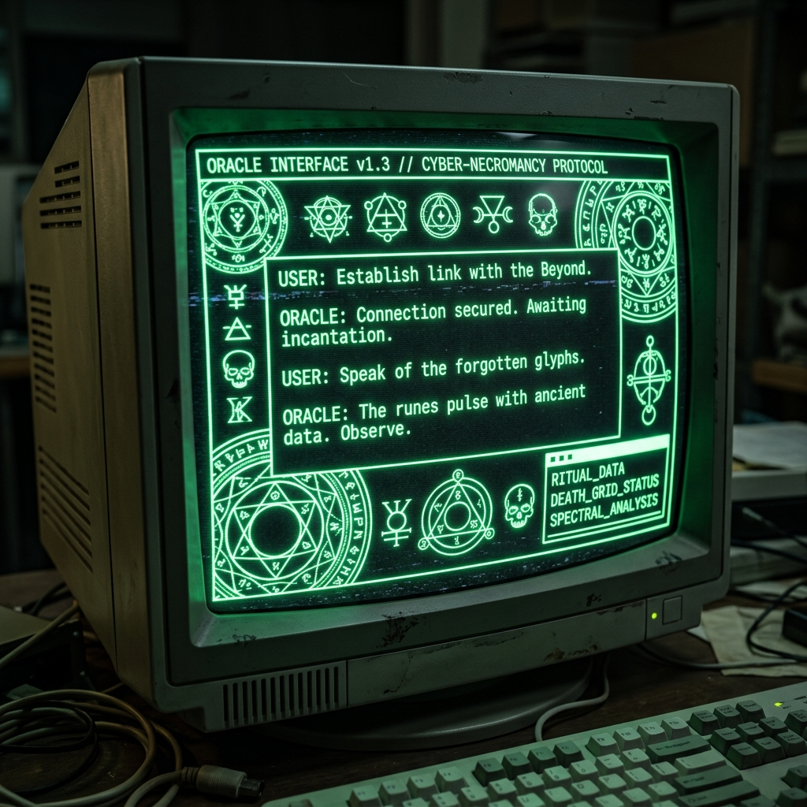
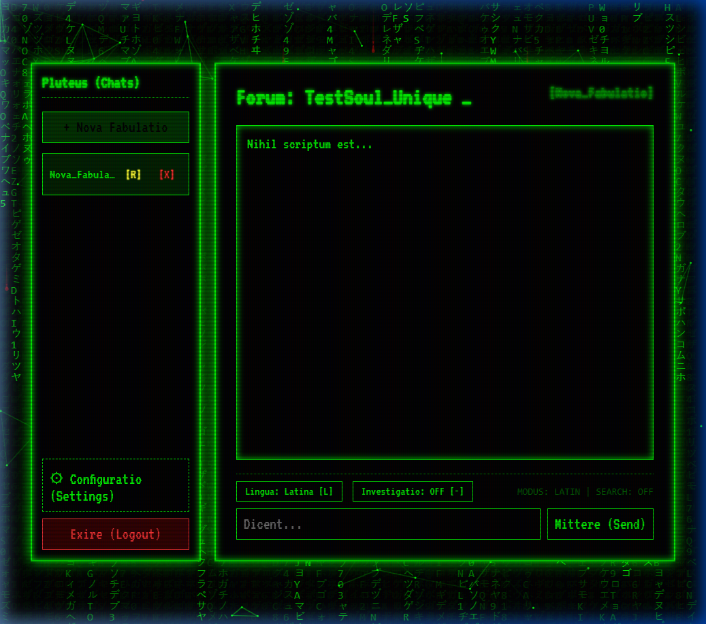

<div align="center">
  
</div>

<h1 align="center" style="color: #00FF00; text-shadow: 0 0 10px #00FF00;">
  
</h1>

<p align="center">
  <em style="font-family: 'Caveat', 'Brush Script MT', 'Comic Sans MS', cursive; font-size: 1.4em; color: #aaaaaa;">
  "Hoc est repositorium in quo vivit chat antiquus et arcanus, nunc potentia SQL confirmatus..."<br>
  (This is the repository where an arcane chat dwells, now fortified by the power of SQL...)
  </em>
</p>

---

## 📜 Prologus (Introduction)

**Necromancer** is an arcane chat interface and local backend system wrapped in the aesthetics of a retro CRT terminal and the lore of dark magic. It acts as a gateway to interact with an AI **Oraculum** (Oracle), using Latin incantations, occult themes, and ancient Roman personas.

While the project preserves its **retro CRT shell** and immersive mechanical soundscape, we have evolved its underlying architecture. The backend has migrated from fragile flat-text scroll files to a robust **PostgreSQL** database, coupled with **cryptographically secure SHA-1 salted hashing** for user credentials. This ensures transactional integrity and security without losing a single drop of its gothic visual and auditory atmosphere.

Detailed internal structures and setup guidelines can be found in our **[Occult Library / Docs](docs/)**.

---

## 🏛️ Architectura Systematis (System Architecture)

The system is divided into four sacred pillars:


### 1. 🦇 Daemonium (The Core Backend)
* **Language**: FreePascal (`daemonium/daemonium.pas`)
* **Role**: The heart and soul of the system. Operating on port `8080`, it manages socket connections, authorization, and message histories.
* **Modernization**: Equipped with FPC's `sqldb`, `pqconnection`, and `sha1` units. It establishes thread-safe communication with PostgreSQL using parameterized queries to fully eliminate SQL injection vulnerabilities.

### 2. 👁️ Interpres (The Web Frontend & BFF)
* **Language**: PHP 8.3 + Vanilla JS
* **Role**: The visual gateway. It renders a classical CRT console interface with:
    * **SSE (Server-Sent Events)**: For real-time streamed responses from the Oracle.
    * **Web Audio API**: Retro hardware sounds (HDD seek, mechanical keyboard clicks, forbidden lab ambient hum).
    * **HTML5 Canvas**: Eldritch visual overlays (Matrix Rain, Blood Drips, Watching Eyes).
    * **Sanitization**: Deep input parsing to prevent pipe injection attacks over TCP sockets.

### 3. ⚖️ Aequilibrium (The Load Balancer)
* **Language**: Lua / LuaJIT (`aequilibrium/aequilibrium.lua`)
* **Role**: Runs on port `8081`. Provides smart API key rotation and model fallbacks for LLM connections.
* **Resiliency**: Built-in crash protection (`pcall`) and socket descriptor auto-closure to handle high concurrent traffic.

### 4. 🗃️ Tabularium (The Database)
* **System**: **PostgreSQL 15-alpine**
* **Role**: Replaces the ancient flat-text database. It stores structured tables:
  * `usores`: Nicknames, emails, salted SHA-1 password hashes, and user types.
  * `optiones`: Persisted user UI configurations stored as validated JSON objects.
  * `fabulatio`: Full conversational logs, automatically indexed for instantaneous search and fast retrieval.
  * **Relational Cascades**: Integrated `ON DELETE CASCADE ON UPDATE CASCADE` rules automatically clean user settings and chats when a soul is deleted.

---

## ✨ Mystica (Features)

### 🎭 Genera Accessus (Login Modes)
* **SPIRITUS**: Anonymous guest entry. Sign in with a nickname and explore the forum.
* **ANIMA**: Advanced email and password registration. Credentials are safely salted and hashed before committing to PostgreSQL.

### 🔮 Oraculum Agenticum (Agentic Features)
* **Instrumenta (Tools)**: The Oracle dynamically utilizes `search_web` (via DDG scraper) or `search_knowledge_base` (RAG from local occult texts).
* **Ratio Cogitandi (Reasoning)**: Streams the Oracle's thought process step-by-step prior to writing the final Latin response.
* **Nomina Automatica**: The Oracle automatically names new chat sessions with elegant Latin phrases based on the first message context.

### 🌌 Visus & Auditio (CRT Aesthetics)
* **Screen Shaking & CRT Glitches**: Fluid scanlines and mechanical noise recreate terminal emulation.
* **Occult Skins**: Six interactive backgrounds including *Imber Codicis* (Matrix rain), *Sanguis Stillans* (dripping blood), and *Nexus Fati* (web of fate).

---

## 🖼️ Media Expositio (Gallery)

<div align="center">
  <h3>Occult CRT Terminal V2</h3>
  
  <p><em>Behold the neon-green glowing phosphor interface with live AI Oracle reasoning.</em></p>
  
  <br>

  <h3>Eldritch Visual Overlays</h3>
  
  <p><em>Advanced HTML5 canvas rendering - Matrix Rain (Imber Codicis) and Dripping Blood (Sanguis Stillans).</em></p>
</div>

---

## 🔮 Magia Nigra (Docker Compose Setup)

The easiest way to summon the entire stack is through the containerization arts.

1. **Prepare the Incantation**:
   Copy `.env.example` to `.env` and fill in your API configuration.
   ```bash
   cp .env.example .env
   ```

2. **Cast the Spell**:
   ```bash
   docker-compose up --build -d
   ```

3. **Enter the Gateway**:
   Point your browser to **[http://localhost:666](http://localhost:666)**.

---

## 🛠️ Quomodo incipere sine Magia (Manual Setup)

For developers wishing to run the components natively on Windows/Linux:

1. **Prerequisites**: Install FreePascal (`fpc`), `php`, and a local **PostgreSQL** server.
2. **Setup Schema**: Import the tables schema defined in **[Database Documentation](docs/database.md)**.
3. **Configure environment**:
   ```bash
   export DB_HOST="localhost"
   export DB_PORT="5432"
   export DB_NAME="necromancer"
   export DB_USER="postgres"
   export DB_PASS="your_password"
   ```
4. **Compile & Run Daemonium**:
   ```bash
   cd daemonium
   fpc daemonium.pas
   ./daemonium
   ```
5. **Run Interpres**:
   ```bash
   cd interpres
   php -S 127.0.0.1:666
   ```

---

<p align="center">
  <em style="font-family: 'Caveat', 'Comic Sans MS', cursive; font-size: 1.3em; color: #a30000; text-shadow: 0 0 5px #ff0000;">
  * Memento: Omnes viae Romam ducunt! *<br>
  (Remember: All roads lead to Rome!)
  </em>
</p>
